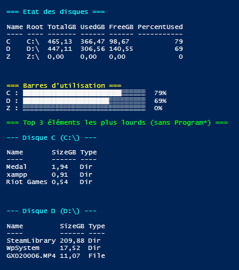

# 🖥️ IS2 – Labo PowerShell - Exam

## 👤 Auteur
**Nom :** Ryan K
**Cours :** IS2  
**Projet :** Script PowerShell + évolution via IA + commits GitHub

---

# 📌  Description du projet

Ce projet consiste à créer un script **PowerShell** permettant :

- d’afficher tous les disques présents sur la machine  
- de les trier du plus rempli au moins rempli
- d’améliorer l'affichage grâce à une **mise en forme avancée**  
- de générer une **visualisation esthétique** de l’espace disque (barres)
- de lister pour chaque disque les **3 dossiers les plus lourds** 

Le script final a été amélioré à l’aide d’une IA, après une discussion détaillée.

---

# 🤵 1  Création du script de base

Pour le script de base, j’ai créé un script permettant de lister les différents disques, 
de les placer dans un tableau et d’afficher leur capacité totale, 
la capacité utilisée, ainsi que l’espace libre restant.

## ⚙️ Script PowerShell

```powershell
$drives = Get-PSDrive -PSProvider FileSystem | ForEach-Object {
    $used = $_.Used
    $free = $_.Free
    $total = $used + $free

    [PSCustomObject]@{
        Name     = $_.Name
        TotalGB  = "{0:N2} GB" -f ($total / 1GB)
        UseeGB   = "{0:N2} GB" -f ($used / 1GB)
        LibreGB  = "{0:N2} GB" -f ($free / 1GB)
    }
}

$drives | Sort-Object UseeGB -Descending | Format-Table
```
---

# 🤖 2. Phase IA — Discussion complète

### 💬 Première demande à l’IA
J'ai demandé à l'IA d'ajouter les fonctionnalités que je souhaitais.
Lorsque j'ai exécuté son code, l'application a planté pendant 10 minutes.
J'ai profité de ce problème pour lui demander de corriger son erreur et d'expliquer ce qui n'allait pas dans le code.
L'IA a ensuite trouvé une solution qui a parfaitement fonctionné.
## Lien de la discution: https://chatgpt.com/share/6938446a-9224-8004-9323-8641208b6673

```powershell
# ==========================
#  FONCTION: Taille sécurisée
# ==========================
function Get-SafeSize {
    param(
        [string]$Path,
        [int]$TimeoutSeconds = 4
    )

    $job = Start-Job -ScriptBlock {
        param($P)
        try {
            if ((Get-Item $P -ErrorAction Stop).PSIsContainer) {
                $sum = Get-ChildItem -Path $P -Recurse -File -Force -ErrorAction SilentlyContinue |
                       Measure-Object -Property Length -Sum
                return $sum.Sum
            } else {
                return (Get-Item $P -ErrorAction Stop).Length
            }
        } catch {
            return 0
        }
    } -ArgumentList $Path

    if (Wait-Job $job -Timeout $TimeoutSeconds) {
        $result = Receive-Job $job
    } else {
        Stop-Job $job | Out-Null
        $result = 0   # Timeout → on évite de bloquer
    }

    Remove-Job $job -Force | Out-Null
    return [int64]$result
}

# ==========================
#  Liste des disques
# ==========================
$drives = Get-PSDrive -PSProvider FileSystem | ForEach-Object {
    $used = $_.Used
    $free = $_.Free
    $total = $used + $free
    $perc  = if ($total -gt 0) { [math]::Round(($used / $total) * 100) } else { 0 }

    [PSCustomObject]@{
        Name        = $_.Name
        Root        = $_.Root
        TotalGB     = "{0:N2}" -f ($total / 1GB)
        UsedGB      = "{0:N2}" -f ($used / 1GB)
        FreeGB      = "{0:N2}" -f ($free / 1GB)
        PercentUsed = $perc
    }
}

# ==========================
#  Affichage tableau
# ==========================
Write-Host "`n=== Etat des disques ===" -ForegroundColor Cyan

$drives | Format-Table -AutoSize

# ==========================
#  Barres
# ==========================
Write-Host "`n=== Barres d'utilisation ===" -ForegroundColor Yellow

foreach ($d in $drives) {
    $len = 30
    $filled = [math]::Round(($d.PercentUsed / 100) * $len)
    $bar = ("█" * $filled) + ("░" * ($len - $filled))
    Write-Host "$($d.Name) : $bar  $($d.PercentUsed)%"
}

# ==========================
#  TOP 3 éléments
# ==========================
Write-Host "`n=== Top 3 éléments les plus lourds (sans Program*) ===" -ForegroundColor Green

$exclude = @("Windows","Program Files","Program Files (x86)","ProgramData","$env:USERNAME\AppData")

foreach ($d in $drives) {
    Write-Host "`n--- Disque $($d.Name) ($($d.Root)) ---" -ForegroundColor Cyan
    
    try {
        $items = Get-ChildItem -LiteralPath $d.Root -Force -ErrorAction SilentlyContinue |
                 Where-Object { $exclude -notcontains $_.Name }

        $list = foreach ($i in $items) {
            $size = Get-SafeSize -Path $i.FullName
            [PSCustomObject]@{
                Name = $i.Name
                FullName = $i.FullName
                SizeGB = "{0:N2}" -f ($size / 1GB)
                Bytes = $size
                Type = if ($i.PSIsContainer) { "Dir" } else { "File" }
            }
        }

        $list | Sort-Object Bytes -Descending | Select-Object -First 3 |
            Format-Table Name,SizeGB,Type -AutoSize

    } catch {
        Write-Host "Erreur: $($_.Exception.Message)" -ForegroundColor Red
    }
}
```
---

# 🧰 3. Contenu du dépôt

| Fichier | Description |
|--------|-------------|
| `drives.ps1` | Script PowerShell final |
| `commit1.png` | Capture du premier commit (résultat) |
| `commit2.png` | Capture du deuxième commit (résultat) |
| `README.md` | Rapport complet |
| `LICENSE` | Licence du projet |

---

# 🪵 4. Fonctionnalités ajoutées grâce à l’IA

### ✔️ **1. Tableau formaté et automatique**
Affichage coloré, aligné et dynamique selon le nombre de disques.

### ✔️ **2. Visualisation graphique de l’espace disque**
Barre horizontale représentant la part utilisée.

### ✔️ **3. Recherche des trois dossiers les plus lourds**
Analyse récursive avec tri des tailles.

---

# 📸 5. Résultats obtenus

## script de base


## script modifié à l'aide de l'IA


---

